# Architecture & Concepts Guide — Why Every Piece of This Stack Exists

This document explains **what each technology/resource is, why this
project needs it specifically, and the commands that touch it.** Use the
`README.md` for step-by-step setup; use this doc to explain/defend design
choices (e.g. in a viva or code review).

Screenshots below are illustrative evidence for each concept — the full
capture set (infra, app, monitoring, scaling, teardown) lives in
`docs/updated-screenshots/` and is indexed in `README.md`'s
[Screenshots](./README.md#screenshots) section.

---

## Table of Contents
1. [Networking layer: VPC, Subnets, IGW, NAT, Elastic IP](#networking)
2. [Terraform state: S3 + DynamoDB](#state)
3. [Compute: EKS vs. plain EC2](#eks)
4. [IAM roles: why three separate roles](#iam)
5. [Container registry: ECR](#ecr)
6. [Configuration management: Ansible](#ansible)
7. [Kubernetes objects: Namespace, Deployment, Service, HPA, Ingress](#k8s)
8. [AWS Load Balancer Controller](#albc)
9. [CI/CD: Jenkins + ngrok](#jenkins)
10. [Observability: Prometheus + Grafana](#monitoring)
11. [Quick command reference](#commands)

---

## 1. Networking layer: VPC, Subnets, IGW, NAT, Elastic IP

### At a glance

Concrete layout provisioned by `terraform/modules/vpc` for the `dev` environment:

| Resource | CIDR / detail | AZ |
|---|---|---|
| VPC | `10.0.0.0/16` | — |
| Public subnet 0 | `10.0.101.0/24` (`kubernetes.io/role/elb=1`) | `us-east-1a` |
| Public subnet 1 | `10.0.102.0/24` (`kubernetes.io/role/elb=1`) | `us-east-1b` |
| Private subnet 0 | `10.0.1.0/24` (`kubernetes.io/role/internal-elb=1`) | `us-east-1a` |
| Private subnet 1 | `10.0.2.0/24` (`kubernetes.io/role/internal-elb=1`) | `us-east-1b` |
| NAT Gateway | 1 shared (`single_nat_gateway = true`), in public subnet 0 | `us-east-1a` |

Routing: the single public route table (`0.0.0.0/0 → IGW`) is associated to both
public subnets; each private subnet gets its own route table, but both send
`0.0.0.0/0` to the same shared NAT Gateway. The subnet role tags above are what
let the AWS Load Balancer Controller auto-discover which subnets to place
internet-facing vs. internal ELBs in. The VPC's implicit default security
group is also explicitly managed with no rules, closing the normally
wide-open AWS default.

### VPC (Virtual Private Cloud)
**What:** An isolated, private network inside AWS — your own slice of AWS
with its own IP address range (`10.0.0.0/16` in this project).
**Why needed:** EKS, EC2, and every other AWS compute resource must live
inside *some* network. Without a VPC you have no control over IP ranges,
routing, or which resources can talk to which — AWS won't let EKS exist
outside one. It's the container for everything else in this list.

### Public subnets vs. private subnets
**What:** A VPC is carved into subnets. Public subnets have a route to
the internet directly (via an Internet Gateway); private subnets don't.
**Why needed:** Your EKS worker nodes live in **private subnets** —
they should never be directly reachable from the internet (a compromised
pod on a publicly-exposed node is a much bigger blast radius). Only the
load balancer (in public subnets) is internet-facing; traffic reaches
your app by hopping: `internet → ALB (public subnet) → pod (private subnet)`.
This is the standard "app is private, only the front door is public" pattern.

### Internet Gateway (IGW)
**What:** The one thing that lets *anything* in a VPC reach the public
internet at all.

**Why needed:** Without it, nothing in the VPC — public or private
subnet — has any path out. It's attached once per VPC and referenced by
route tables.

### NAT Gateway
**What:** A managed service that lets resources in a **private** subnet
initiate outbound connections to the internet (e.g. pulling a Docker
image, calling an AWS API), **without** being reachable *from* the
internet.
**Why needed:** Your EKS nodes are in private subnets (see above) but
still need outbound internet — to pull container images from ECR/Docker
Hub, to call the EKS/EC2 APIs, to run `apt`/`npm` during Ansible
configuration, etc. NAT Gateway is the one-way door: outbound yes,
inbound no.
**Cost note:** This is one of the most expensive small resources in the
project (~$32/mo + data processing charges). This project intentionally
uses a **single shared NAT Gateway** (`single_nat_gateway = true` in the
VPC module) instead of one per Availability Zone — full multi-AZ NAT
redundancy is an HA pattern real production systems want, but for a
learning/demo project it roughly doubles cost for no benefit while
you're the only user.

### Elastic IP (EIP)
**What:** A static, persistent public IPv4 address you own until you
release it (as opposed to a dynamic IP that changes on stop/start).
**Why needed:** The NAT Gateway needs *one fixed* public IP address so
that outbound traffic from your private subnet always appears to come
from the same known address — useful for things like IP allowlisting on
external services, and it's simply a hard requirement of how AWS
provisions a NAT Gateway (`aws_eip` + `aws_nat_gateway` are created
together in `terraform/modules/vpc/main.tf`).

### Route tables
**What:** The rules that decide where traffic from a subnet goes.
**Why needed:** A public subnet's route table sends `0.0.0.0/0` (i.e.
"anywhere") traffic to the Internet Gateway. A private subnet's route
table sends `0.0.0.0/0` to the NAT Gateway instead. This is *the*
mechanism that actually enforces "private subnets can't be reached
directly from outside" — it's not a firewall rule, it's the absence of
any inbound route.

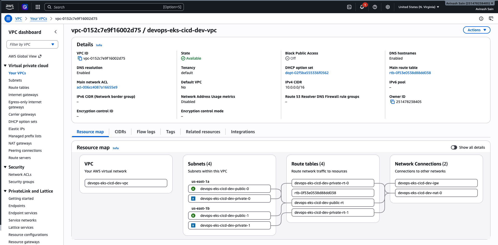
*The VPC provisioned by `terraform/modules/vpc`.*

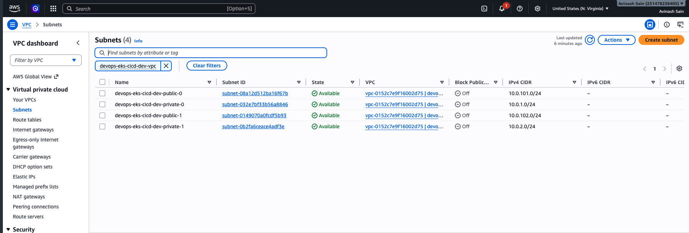
*Public + private subnets across AZs.*

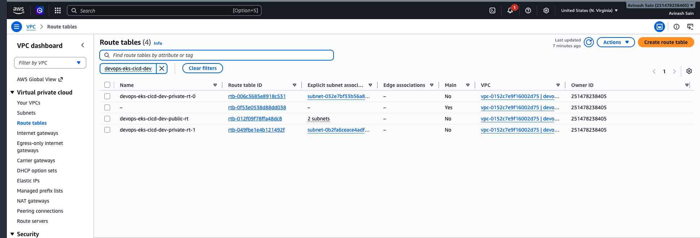
*Route tables — public subnet routes `0.0.0.0/0` to the IGW, private to the NAT Gateway.*

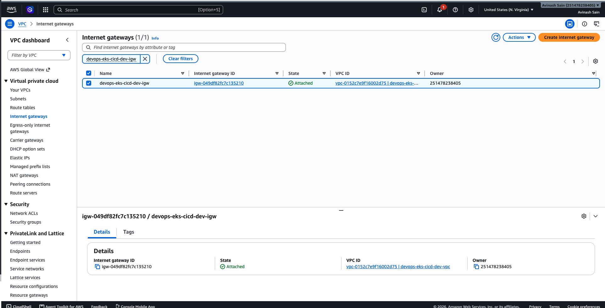
*The Internet Gateway attached to the VPC.*

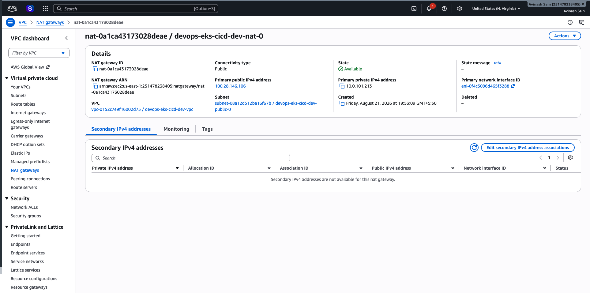
*The single shared NAT Gateway (cost trade-off discussed above).*

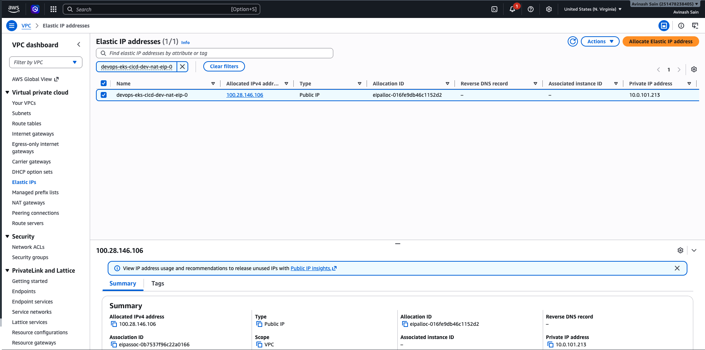
*The Elastic IP bound to the NAT Gateway.*

---

<a name="state"></a>
## 2. Terraform state: S3 (native locking) + an unused DynamoDB table

### S3 bucket (remote state backend)
**What:** Terraform tracks every resource it manages in a "state file"
(`terraform.tfstate`) — a JSON record of what exists and its current
config.
**Why needed:** If state lives only on your laptop, it's a single point
of failure (delete your laptop, lose the ability to safely modify your
infrastructure again) and can't be shared with teammates or CI/CD
pipelines. Storing it in S3 makes it durable, versioned (you can roll
back to a previous state file), and centrally accessible.

### State locking — S3 native lockfile, not DynamoDB
**What actually locks state in this project:** `terraform/environments/dev/backend.tf`
sets `use_lockfile = true` on the `s3` backend — Terraform ≥1.10's native
S3-object-based locking (a `.tflock` object written alongside the state
file), not the classic `dynamodb_table` attribute.
**Why this matters:** `scripts/bootstrap-backend.sh` *also* creates a
`tf-locks` DynamoDB table (the traditional pre-1.10 locking mechanism),
but `backend.tf` never references it — no `dynamodb_table = "tf-locks"`
line. The table exists in AWS (see screenshot below) but is currently
dead weight; only the S3 lockfile is doing real locking. If you're
paying for anything here, it's a stale table, not a load-bearing one —
worth deleting, or worth wiring `dynamodb_table` back in if you want
belt-and-suspenders locking across a Terraform version downgrade.
**Why S3-native locking is enough on its own:** It gives the same
single-writer guarantee (only one `apply` can hold the lockfile at a
time) without a second AWS resource to create, tag, and pay for.

**Commands:**
```bash
./scripts chmod +x bootstrap-backend.sh
./scripts/bootstrap-backend.sh <bucket-name> us-east-1   # creates the bucket (+ the now-unused tf-locks table)
cd terraform/environments/dev && terraform init          # connects to the S3 backend; locking is via use_lockfile
```

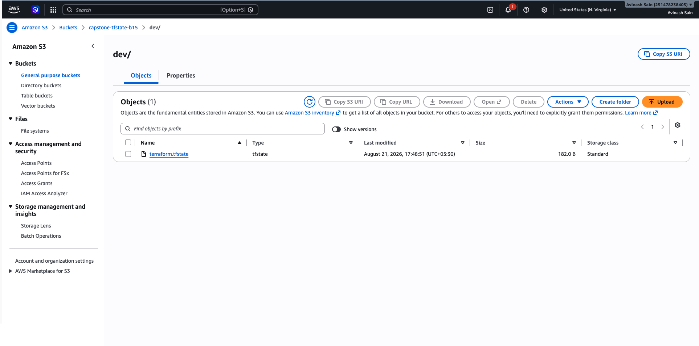
*The S3 bucket holding `terraform.tfstate` — this is what's actually load-bearing.*

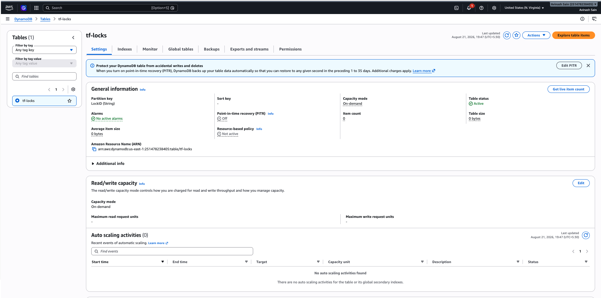
*The `tf-locks` DynamoDB table created by `bootstrap-backend.sh` — currently unreferenced by `backend.tf`.*

---

<a name="eks"></a>
## 3. Compute: EKS vs. plain EC2

### Why Kubernetes at all (vs. just running Docker on an EC2 instance)
**What Kubernetes gives you:** automatic restart of crashed containers,
horizontal scaling based on load (HPA), rolling deployments with
zero-downtime rollout/rollback, service discovery, and a declarative
model (`kubectl apply -f`) instead of manually SSH-ing in to restart
processes.
**Why this project needs it specifically:** The project's whole point is
demonstrating a *repeatable, self-healing* deployment pipeline — "push
code, it lands on infrastructure that manages itself" — which is exactly
what Kubernetes' reconciliation loops provide and plain EC2 does not.

### Why EKS (managed) instead of self-managed Kubernetes (e.g. kubeadm on EC2)
**What EKS is:** AWS runs and patches the Kubernetes **control plane**
(API server, etcd, scheduler) for you; you only manage worker nodes.
**Why needed:** Running your own control plane means you're responsible
for etcd backups, control-plane HA, security patching of core Kubernetes
components, and version upgrades — a lot of operational burden for a
project whose actual goal is the CI/CD pipeline, not Kubernetes
internals. EKS trades a fixed ~$73/mo control-plane fee for removing all
of that.

### Managed Node Group + Spot capacity
**What:** A Node Group is AWS managing the EC2 instances that join your
cluster as worker nodes — handling bootstrapping, joining, and
replacing unhealthy nodes automatically.
**Why Spot specifically:** Spot instances are spare AWS capacity sold at
a steep discount (often 60-70% off on-demand) with the trade-off that
AWS can reclaim them with short notice. For a learning project where
brief interruptions are a non-issue (Kubernetes just reschedules the pod
elsewhere), Spot is a straightforward cost win. Production systems
serving real traffic often mix Spot + On-Demand for exactly this
resilience trade-off.

**Commands:**
```bash
aws eks update-kubeconfig --region us-east-1 --name devops-eks-cicd-dev-eks
kubectl get nodes
```

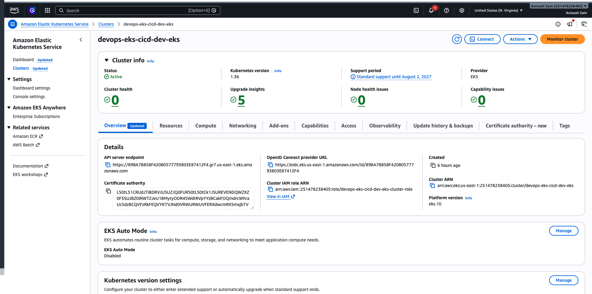
*The `devops-eks-cicd-dev-eks` cluster in the AWS console.*

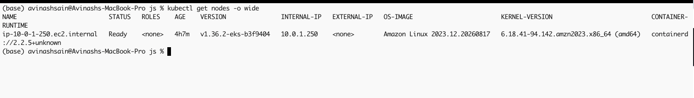
*The Spot `t3.medium` worker node registered and `Ready`.*

---

<a name="iam"></a>
## 4. IAM roles: why three separate roles

This project creates (at least) three distinct IAM roles rather than one
shared role — each maps to a different **principal** (thing that needs
permission) and follows least-privilege:

| Role | Who assumes it | Why it's separate |
|---|---|---|
| EKS cluster role | The EKS control plane itself | Needs permission to manage ENIs/networking on your behalf — nothing else should have this power |
| Node role | Every EC2 worker node | Needs to register with the cluster, pull images from ECR, manage its own networking (CNI) — but should **not** have control-plane-level permissions |
| Load Balancer Controller role (IRSA) | One specific Kubernetes pod, via a Kubernetes service account | Needs to create/manage ALBs and security groups — no other pod in the cluster should be able to do this |

**Why not one big role for everything:** if a single over-privileged
role is compromised (e.g. a vulnerable container escapes), the attacker
inherits *everything* that role can do. Separate roles mean a compromised
app pod (which has no special role at all) can't touch ALB or EKS APIs.

**IRSA (IAM Roles for Service Accounts)** specifically is what lets a
*single Kubernetes service account* — not the whole node — assume an IAM
role. This is why the Load Balancer Controller needed
`eksctl create iamserviceaccount`, not just "give the node role more
permissions": scoping the permission to one pod's identity, not every
pod on that node.

---

<a name="ecr"></a>
## 5. Container registry: ECR

**What:** A private Docker image registry, AWS's equivalent of Docker Hub.
**Why needed (vs. Docker Hub):** Your EKS nodes need to pull the app's
image on every deploy. ECR integrates directly with IAM (node role gets
`AmazonEC2ContainerRegistryReadOnly` — no separate registry
login/credentials to manage), keeps images inside your AWS account/region
(lower latency, no public exposure of your image), and enforces
authentication by default (Docker Hub's free tier images are public
unless you pay).
**Why the lifecycle policy:** Every Jenkins build pushes a new tagged
image. Without cleanup, storage (and cost) grows unbounded. The
lifecycle policy expires untagged images after 3 days automatically.

**Commands:**
```bash
aws ecr get-login-password --region us-east-1 | docker login --username AWS --password-stdin <ECR_URL>
docker buildx build --platform linux/amd64 -t <ECR_URL>:<tag> --push .
```

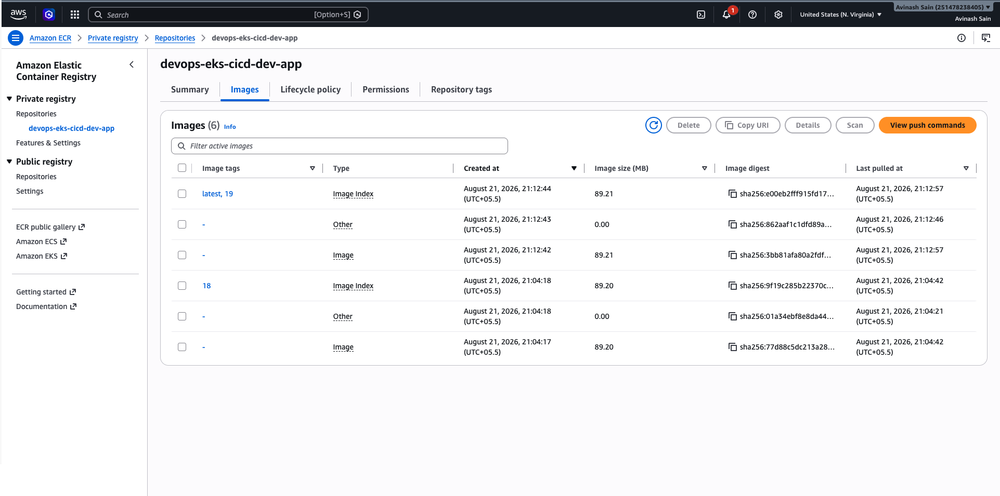
*Pushed image tags, one per Jenkins build.*

---

<a name="ansible"></a>
## 6. Configuration management: Ansible

**What:** A tool that connects over SSH to remote Linux hosts and brings
them to a declared state (install packages, start services, write config
files) — idempotently (running it twice produces the same end state, not
duplicated effects).
**Why it's in this project's design, but optional in your actual setup:**
Ansible's job here is configuring **raw EC2 instances** — e.g. a
dedicated Jenkins EC2 host, or any bastion/utility box — installing
Docker, kubectl, AWS CLI, and Jenkins itself via `apt`. Since you're
running Jenkins **locally in Docker on your Mac** instead of on a
provisioned EC2 instance, none of the current roles (`jenkins`, `docker`,
`kubectl`, `awscli` in `ansible/roles/`) actually apply to your machine —
they're Ubuntu/`apt`-based, and macOS uses neither.
**Why it's still valuable to know:** If you ever provision a *real*
Jenkins EC2 instance (the more typical production pattern, vs. running
CI on a personal laptop), Ansible is exactly what would configure it
identically every time — no manual SSH-and-type-commands drift between
environments.

**Commands (once you have a real target host):**
```bash
cd ansible
ansible-playbook playbook.yml --limit jenkins
```

---

<a name="k8s"></a>
## 7. Kubernetes objects: Namespace, Deployment, Service, HPA, Ingress

### Namespace
**What:** A virtual sub-division inside one cluster.
**Why:** Keeps `devops-demo` (your app) and `monitoring`
(Prometheus/Grafana) logically and access-control separated, even though
they share the same physical nodes.

### Deployment
**What:** A declarative spec for "run N copies of this container image,
keep them healthy, and roll out updates without downtime."
**Why:** Without it, you'd be manually running `docker run` on a node and
manually restarting it if it crashed. The Deployment controller's
reconciliation loop does this forever, automatically.
**As actually configured:** `k8s/deployment.yaml` sets `replicas: 3`,
above the HPA's `minReplicas: 1` (below) — the HPA only ever scales up
from the Deployment's current replica count, never below it, so this
app never idles down to 1 pod in practice. Set `replicas: 1` if the
HPA's floor should be the real floor.

### Service (ClusterIP)
**What:** A stable internal network endpoint that load-balances across
however many pod replicas currently exist (pod IPs change every time a
pod restarts; the Service's IP doesn't).
**Why ClusterIP specifically (not LoadBalancer):** A `type: LoadBalancer`
Service provisions its **own** dedicated AWS load balancer *per Service*
— expensive if you have several apps. This project uses one shared ALB
(via Ingress, below) routing to internal `ClusterIP` Services instead —
one load balancer for potentially many apps.

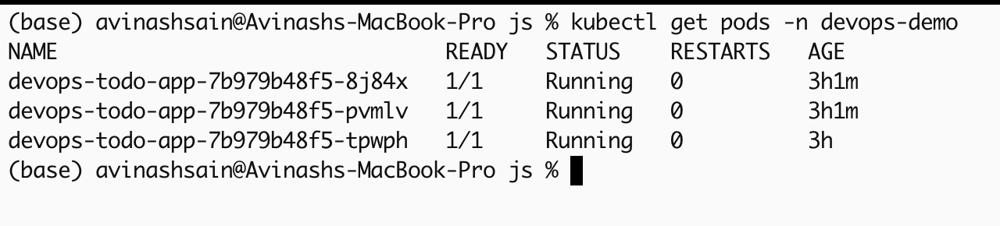
*`kubectl get pods -n devops-demo` — the Deployment's pods, `Running`.*

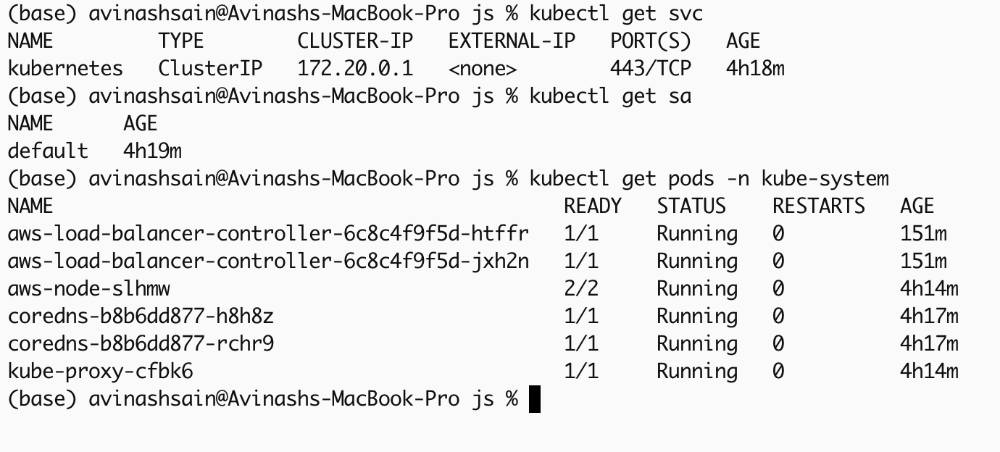
*Grafana's Kubernetes / Networking / Service dashboard for the `ClusterIP` Service.*

### HorizontalPodAutoscaler (HPA)
**What:** Watches a metric (CPU utilization here) and automatically
changes the Deployment's replica count within a min/max range.
**Why:** Avoids two bad outcomes: permanently over-provisioning capacity
"just in case" (wastes money) or under-provisioning and falling over
under real load. Requires the **metrics-server** add-on to actually see
CPU numbers — without it, HPA shows `<unknown>` and can't act.

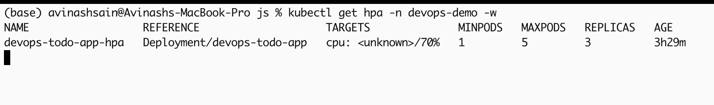
*Replica count scaling out as generated load (see `load-test.png` in the README) pushes CPU past the threshold.*

### Ingress + AWS Load Balancer Controller
**What:** A Kubernetes object describing HTTP routing rules ("send `/`
traffic to this Service"); by itself it's just a routing intent, not
infrastructure.
**Why it needs a controller:** See section 8 below — the Ingress object
alone does nothing without something watching it and actually
provisioning an AWS ALB to match.

---

<a name="albc"></a>
## 8. AWS Load Balancer Controller

**What:** A pod running inside your cluster that watches for `Ingress`
(and `Service` of type `LoadBalancer`) objects and provisions/manages
real AWS Application Load Balancers to match them.
**Why it's not built into EKS by default:** EKS gives you a bare
Kubernetes control plane; AWS deliberately keeps EKS itself minimal, and
add-ons like this are opt-in so you're not paying for or running
components you don't need.
**Why an ALB (Layer 7) here instead of an NLB (Layer 4) or a
per-Service Classic ELB:** ALBs understand HTTP — path-based routing,
host-based routing, health checks against a specific path (`/health` in
this project) — and one ALB can front many Services/paths, which is why
this pattern scales better cost-wise than one load balancer per app.

**Commands:** see the full IAM + Helm install sequence in `README.md`
Step 6 — summarized: IAM policy → IRSA role → `helm install`.

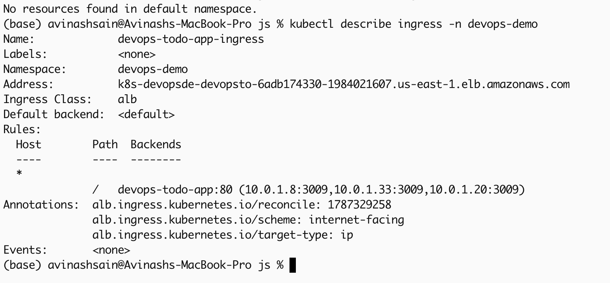
*The `Ingress` object's populated ADDRESS — the controller successfully provisioned an ALB for it.*

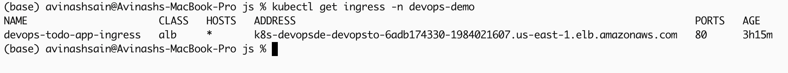
*The resulting internet-facing Application Load Balancer.*

---

<a name="jenkins"></a>
## 9. CI/CD: Jenkins + ngrok

### Jenkins
**What:** The automation server that runs your pipeline stages (test,
build, push, deploy) every time code changes.
**Why needed:** Without it, "deploy" means someone manually running
`docker build`/`push`/`kubectl apply` commands by hand after every code
change — slow, inconsistent, and error-prone. Jenkins makes deployment a
repeatable, triggered, auditable process.

### ngrok
**What:** A tunnel that exposes a port on your local machine to the
public internet via a temporary public URL.
**Why needed specifically because Jenkins runs locally:** GitHub's
webhook needs a public URL to call when you push code. Your Mac, sitting
behind home/office NAT, has no public IP or open inbound port by
default. ngrok bridges that gap without you needing to configure router
port-forwarding or run Jenkins on a public cloud VM (which would cost
money 24/7). The trade-off: this only works while your laptop and the
tunnel are both running — a real production setup would run Jenkins on
a persistently-available host instead.

---

<a name="monitoring"></a>
## 10. Observability: Prometheus + Grafana

### Prometheus
**What:** A time-series database that periodically "scrapes" (pulls)
metrics from configured targets (pods, nodes, the Kubernetes API itself)
and stores them.
**Why needed:** Without metrics, you only find out something's wrong
when a user complains. Prometheus is what makes CPU/memory/replica-count
data queryable and alertable in the first place — it's the data layer
underneath both Grafana's dashboards and the `PrometheusRule` alerts in
this project.

### Grafana
**What:** A dashboarding/visualization layer that queries Prometheus (or
other data sources) and renders graphs.
**Why it's separate from Prometheus rather than one tool:** Prometheus
is optimized purely for metric storage/querying; Grafana is optimized
purely for visualization and can front *multiple* different data
sources at once. Splitting the concerns is why the Kubernetes/cloud-native
ecosystem standardized on "Prometheus for data, Grafana for viewing" as
two composable tools rather than one monolith.

### Why self-hosted here instead of AWS Managed Prometheus/Grafana
**Cost:** AWS's managed versions bill separately (per metric ingested /
per active user) on top of your EKS costs. Self-hosting via Helm inside
the same cluster you're already paying for is close to free for a
low-traffic learning project — the trade-off is you're responsible for
the pods staying healthy yourself.

**Commands:**
```bash
helm install monitoring prometheus-community/kube-prometheus-stack -n monitoring --create-namespace -f monitoring/prometheus-values.yaml
kubectl port-forward -n monitoring svc/monitoring-grafana 3000:80
```

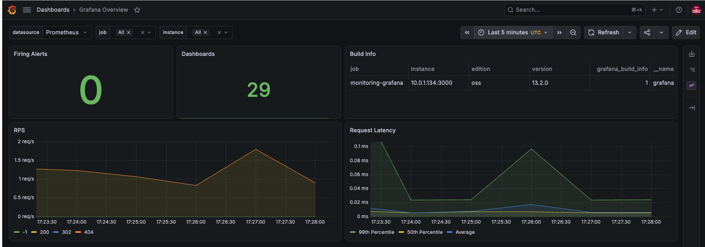
*Grafana querying Prometheus — Kubernetes / Compute Resources / Multi-Cluster dashboard.*

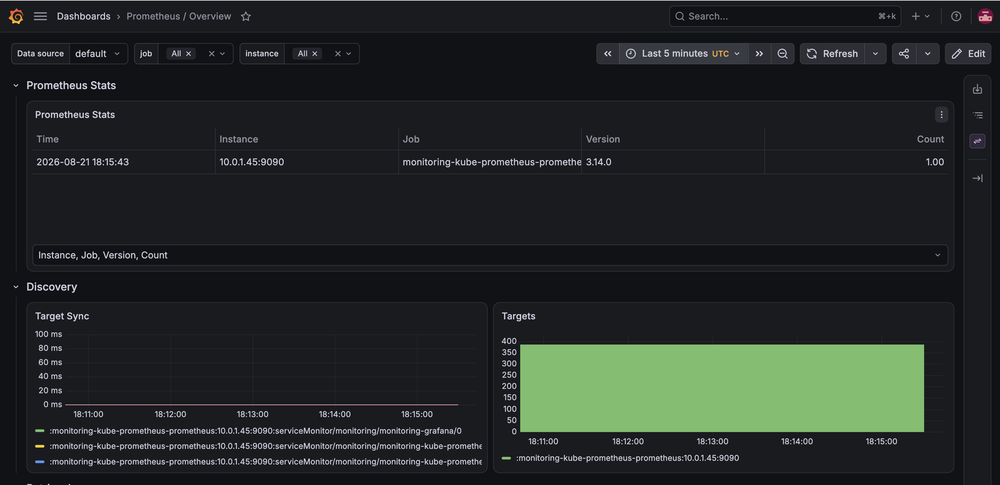
*Prometheus's own UI — scrape targets all UP.*

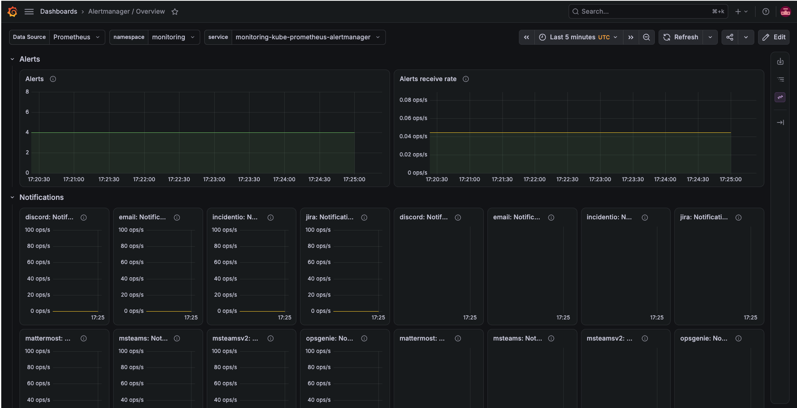
*Alertmanager evaluating the `PrometheusRule` alerts from `monitoring/alerts.yaml`.*

The full dashboard set (API server, Kubelet, CoreDNS, Node Exporter, per-namespace
networking, etc.) is captured in `docs/updated-screenshots/` and indexed in
`README.md`'s [Step 9 gallery](./README.md#step-9).

---

<a name="commands"></a>
## 11. Quick command reference (by concept)

```bash
# Networking / Terraform state — created once
./scripts chmod +x bootstrap-backend.sh
./scripts/bootstrap-backend.sh <bucket-name> us-east-1

# Infrastructure (VPC, EKS, ECR) — Terraform
cd terraform/environments/dev
terraform init
terraform plan
terraform apply
terraform destroy -auto-approve   # teardown

# Point kubectl at the cluster
aws eks update-kubeconfig --region us-east-1 --name devops-eks-cicd-dev-eks

# Configuration management (only relevant for real EC2 hosts, not your Mac)
cd ansible
ansible-playbook playbook.yml --limit jenkins

# Build & push the image (note --platform, see README gotcha)
docker buildx build --platform linux/amd64 -t <ECR_URL>:<tag> --push .

# Deploy to Kubernetes
kubectl apply -f k8s/namespace.yaml
kubectl apply -f k8s/deployment.yaml
kubectl apply -f k8s/service.yaml
kubectl apply -f k8s/hpa.yaml
kubectl apply -f k8s/ingress.yaml
kubectl rollout status deployment/devops-todo-app -n devops-demo

# AWS Load Balancer Controller (IAM + Helm) — see README Step 6 for full sequence
eksctl create iamserviceaccount ...
helm install aws-load-balancer-controller eks/aws-load-balancer-controller ...

# Monitoring
helm install monitoring prometheus-community/kube-prometheus-stack -n monitoring --create-namespace -f monitoring/prometheus-values.yaml
kubectl port-forward -n monitoring svc/monitoring-grafana 3000:80
```
