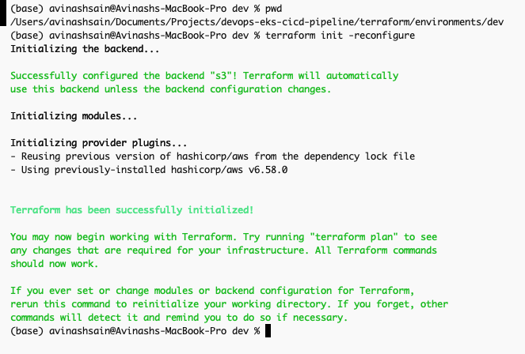
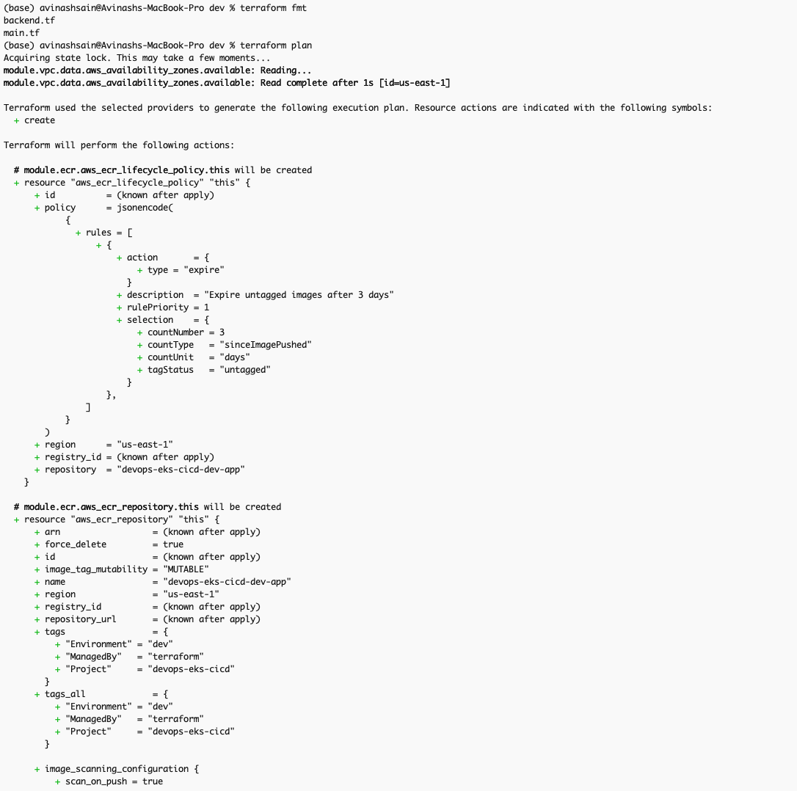
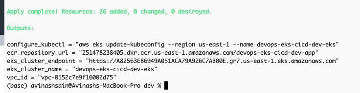
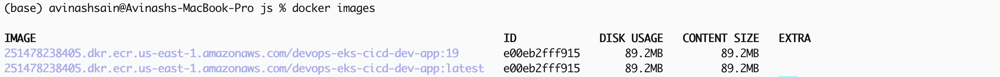
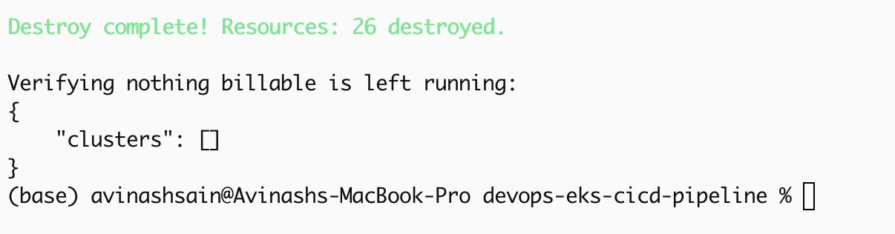

# End-to-End DevOps CI/CD Pipeline — Complete Build Guide (Cost-Optimized)

**Stack:** Jenkins · Docker · Terraform · Ansible · AWS EKS · Prometheus/Grafana
**Design principle:** Every choice below defaults to the cheapest AWS option that still teaches the "real" pattern. Cost callouts are marked 💰.

Sections marked **"actual, from ..."** are the real code running in this
repo (`app/Dockerfile`, `jenkins/Jenkinsfile`, `terraform/`, `k8s/` —
named `devops-eks-cicd-dev-*`, namespace `devops-demo`). Sprint 1's
early examples and Sprint 2.5/Sprint 3's Jenkins/Ansible jobs are still
illustrative generic patterns (`myapp`, `devops-eks`) since this project
runs Terraform manually and doesn't use Ansible — kept as reference for
extending this pipeline that way. Screenshots throughout are from the
actual deployment — proof the pattern works end to end, not just on
paper. Full capture set: `docs/updated-screenshots/`, indexed in
`README.md`'s [Screenshots](./README.md#screenshots) section.

---

## 0. Cost Strategy (read this first)

| Cost driver | Optimization |
|---|---|
| EKS control plane | Fixed ~$0.10/hr (~$73/mo) — unavoidable if using EKS. Only cost you can't shrink. Run `terraform destroy` whenever you stop working. |
| Worker nodes | Use **Spot** instances (`t3.medium`, 1–2 nodes) via a managed node group with `capacity_type = "SPOT"`. Saves ~60–70% vs on-demand. |
| NAT Gateway | Single NAT gateway (not one per AZ) — saves ~$65/mo. For pure learning, consider a NAT instance (`t3.nano`, ~$3/mo) instead of managed NAT (~$32/mo + data). |
| Jenkins server | `t3.micro`/`t3.small` on Spot, or run Jenkins **inside** the EKS cluster as a pod instead of a dedicated EC2 — removes a whole line item. |
| ECR | Free tier: 500MB/month storage. Set lifecycle policy to expire untagged images after 3 days. |
| Prometheus/Grafana | Self-hosted via Helm on the same cluster (not AWS Managed Prometheus/Grafana, which bills separately). |
| CloudWatch | Keep log retention short (3–7 days) to avoid storage creep. |
| Idle time | **The #1 cost lever**: `terraform destroy` at the end of every session. Nothing here needs to run 24/7 for a learning project. |
| Budget guardrail | Set an AWS Budget alert at $20 and $50 on day one, before provisioning anything. |

Set the budget alert now:
```bash
aws budgets create-budget --account-id <ACCOUNT_ID> --budget '{
  "BudgetName": "devops-project-budget",
  "BudgetLimit": {"Amount": "50", "Unit": "USD"},
  "TimeUnit": "MONTHLY",
  "BudgetType": "COST"
}'
```

---

## Sprint 1 — Architecture, Dockerization, Jenkins Setup

### 1.1 Architecture (cost-optimized version)
- Single AZ pair (2 AZs minimum for EKS, not 3) — fewer subnets, fewer NAT paths.
- One managed node group, Spot, `t3.medium`, min=1 / desired=1 / max=3 (autoscaling only under load).
- Jenkins runs as a pod in-cluster (avoids a second EC2 bill) OR on a single `t3.small` Spot instance if you want it isolated from the cluster it manages.
- ALB Ingress Controller for the app instead of a separate Classic/NLB per service — one load balancer shared across services via path/host routing.

### 1.2 Dockerfile (actual, from `app/Dockerfile`)
```dockerfile
# ---- Frontend Build Stage ----
FROM node:20-alpine AS frontend-builder

WORKDIR /frontend

COPY frontend/package*.json ./
RUN npm ci

COPY frontend/ ./
# vite.config.js sets build.outDir to '../public', so this lands at /public
RUN npm run build

# ---- Backend Build Stage ----
FROM node:20-alpine AS builder

# CVE-2026-45447 (libcrypto3/libssl3 heap use-after-free): pull the patched
# alpine package set (fixed in 3.5.7-r0) instead of whatever shipped with
# the base image layer.
RUN apk update && apk upgrade --no-cache

WORKDIR /app

COPY package*.json ./
RUN npm ci --omit=dev && npm cache clean --force

# ---- Runtime Stage ----
FROM node:20-alpine

# Same OS package upgrade in the runtime layer, since this is the image that
# actually ships — the builder stage's packages never reach production.
RUN apk update && apk upgrade --no-cache

RUN addgroup -S appgroup && adduser -S appuser -G appgroup

WORKDIR /app
ENV NODE_ENV=production

COPY --from=builder /app/node_modules ./node_modules
COPY . .
COPY --from=frontend-builder /public ./public

# CVE-2026-13149 / CVE-2026-14257 (brace-expansion), CVE-2024-21538
# (cross-spawn), CVE-2025-64756 (glob), CVE-2026-26996 / 27903 / 27904
# (minimatch), CVE-2026-48815 (sigstore), CVE-2026-59873 and friends (tar):
# every one of these is a transitive dependency of the *npm CLI itself*
# (usr/local/lib/node_modules/npm/node_modules/...), not of this app.
# The container only ever runs `node server.js`, so npm/npx/corepack/yarn
# have no reason to be in the shipped image — remove them and their
# vulnerable dependency trees entirely rather than trying to patch a tool
# that's never invoked.
RUN rm -rf \
      /usr/local/lib/node_modules/npm \
      /usr/local/lib/node_modules/corepack \
      /usr/local/bin/npm \
      /usr/local/bin/npx \
      /usr/local/bin/corepack \
      /opt/yarn-v1.22.22 \
      /usr/local/bin/yarn \
      /usr/local/bin/yarnpkg

RUN chown -R appuser:appgroup /app

USER appuser

# Green deployment runs on port 3009
EXPOSE 3009

# Health check
HEALTHCHECK --interval=30s --timeout=10s --start-period=10s --retries=3 \
  CMD wget -qO- http://localhost:3009/health || exit 1

CMD ["node", "server.js"]
```
💰 Multi-stage build keeps the final image small — smaller images = faster pulls = less data transfer cost, and less ECR storage. The runtime stage also strips the npm/yarn/corepack toolchains entirely, since only `node server.js` ever runs in production — removing them removes their transitive CVEs along with the storage they'd otherwise cost in ECR.

### 1.3 Push to ECR with a lifecycle policy
```bash
aws ecr create-repository --repository-name myapp
aws ecr put-lifecycle-policy --repository-name myapp --lifecycle-policy-text '{
  "rules": [{"rulePriority":1,"description":"Expire untagged >3 days",
  "selection":{"tagStatus":"untagged","countType":"sinceImagePushed","countUnit":"days","countNumber":3},
  "action":{"type":"expire"}}]}'
```

### 1.4 Jenkins on a Spot EC2 (minimal footprint)
```bash
aws ec2 request-spot-instances --instance-count 1 \
  --launch-specification '{
    "ImageId":"ami-0xxxxxxx",
    "InstanceType":"t3.small",
    "SecurityGroupIds":["sg-xxxx"],
    "KeyName":"jenkins-key"
  }'
```
Install Jenkins via the Ansible playbook in Sprint 3 rather than baking a custom AMI — keeps this step free of extra image-storage cost.

Required plugins: **Docker Pipeline, Kubernetes, AWS Credentials, Pipeline: AWS Steps**.

---

## Sprint 2 — Terraform: VPC, EKS, Networking

This project uses hand-rolled modules (`terraform/modules/{vpc,ecr,eks}`)
rather than the public `terraform-aws-modules` registry modules — full
control over exactly what gets created, no unused registry-module
resources to audit for cost.

### 2.1 State backend (actual, from `terraform/environments/dev/backend.tf`)
```hcl
terraform {
  required_version = ">= 1.6"

  required_providers {
    aws = {
      source  = "hashicorp/aws"
      version = "~> 6.0"
    }
  }

  # Run scripts/bootstrap-backend.sh once
  # to create the S3 bucket before the first `terraform init`.
  backend "s3" {
    bucket       = "capstone-tfstate-b15"
    key          = "dev/terraform.tfstate"
    region       = "us-east-1"
    use_lockfile = true
    encrypt      = true
  }
}

provider "aws" {
  region = var.aws_region
}
```
💰 `use_lockfile = true` uses S3's native locking (Terraform ≥1.10) instead of a separate DynamoDB table — one fewer billable resource for the same guarantee. An S3 bucket costs pennies — always cheaper than losing state.

### 2.2 Root composition (actual, from `terraform/environments/dev/main.tf`)
```hcl
locals {
  name = "${var.project_name}-${var.environment}"
  tags = {
    Project     = var.project_name
    Environment = var.environment
    ManagedBy   = "terraform"
  }
}

module "vpc" {
  source = "../../modules/vpc"

  name               = local.name
  single_nat_gateway = true # 💰 keep this true unless you need multi-AZ HA
  tags               = local.tags
}

module "ecr" {
  source = "../../modules/ecr"

  repository_name            = "${local.name}-app"
  expire_untagged_after_days = 3
  tags                       = local.tags
}

module "eks" {
  source = "../../modules/eks"

  cluster_name        = "${local.name}-eks"
  vpc_id              = module.vpc.vpc_id
  private_subnet_ids  = module.vpc.private_subnet_ids
  public_subnet_ids   = module.vpc.public_subnet_ids
  node_instance_types = ["t3.medium"]
  capacity_type       = "SPOT" # 💰 switch to ON_DEMAND only if Spot capacity is unavailable
  desired_size        = 1
  min_size            = 1
  max_size            = 2
  tags                = local.tags
}
```

### 2.3 VPC module — 2 AZs, single NAT (actual, from `terraform/modules/vpc/main.tf`)
```hcl
data "aws_availability_zones" "available" {
  state = "available"
}

locals {
  # Use explicit var.azs if given; otherwise auto-pick the first 2 AZs ("us-east-1a", "us-east-1b")
  azs = length(var.azs) > 0 ? var.azs : slice(data.aws_availability_zones.available.names, 0, 2)
}

resource "aws_vpc" "this" {
  cidr_block           = var.vpc_cidr
  enable_dns_support   = true
  enable_dns_hostnames = true
  tags                 = merge(var.tags, { Name = "${var.name}-vpc" })
}

resource "aws_internet_gateway" "this" {
  vpc_id = aws_vpc.this.id
  tags   = merge(var.tags, { Name = "${var.name}-igw" })
}

# ---- Public subnets ----
resource "aws_subnet" "public" {
  count                   = length(var.public_subnet_cidrs)
  vpc_id                  = aws_vpc.this.id
  cidr_block              = var.public_subnet_cidrs[count.index]
  availability_zone       = local.azs[count.index]
  map_public_ip_on_launch = true
  tags = merge(var.tags, {
    Name                     = "${var.name}-public-${count.index}"
    "kubernetes.io/role/elb" = "1"
  })
}

resource "aws_route_table" "public" {
  vpc_id = aws_vpc.this.id
  route {
    cidr_block = "0.0.0.0/0"
    gateway_id = aws_internet_gateway.this.id
  }
  tags = merge(var.tags, { Name = "${var.name}-public-rt" })
}

resource "aws_route_table_association" "public" {
  count          = length(aws_subnet.public)
  subnet_id      = aws_subnet.public[count.index].id
  route_table_id = aws_route_table.public.id
}

# ---- Private subnets ----
resource "aws_subnet" "private" {
  count             = length(var.private_subnet_cidrs)
  vpc_id            = aws_vpc.this.id
  cidr_block        = var.private_subnet_cidrs[count.index]
  availability_zone = local.azs[count.index]
  tags = merge(var.tags, {
    Name                              = "${var.name}-private-${count.index}"
    "kubernetes.io/role/internal-elb" = "1"
  })
}

# ---- NAT (single, cost-optimized) ----
resource "aws_eip" "nat" {
  count  = var.single_nat_gateway ? 1 : length(var.private_subnet_cidrs)
  domain = "vpc"
  tags   = merge(var.tags, { Name = "${var.name}-nat-eip-${count.index}" })
}

resource "aws_nat_gateway" "this" {
  count         = var.single_nat_gateway ? 1 : length(var.private_subnet_cidrs)
  allocation_id = aws_eip.nat[count.index].id
  subnet_id     = aws_subnet.public[count.index].id
  tags          = merge(var.tags, { Name = "${var.name}-nat-${count.index}" })
  depends_on    = [aws_internet_gateway.this]
}

resource "aws_route_table" "private" {
  count  = length(var.private_subnet_cidrs)
  vpc_id = aws_vpc.this.id
  route {
    cidr_block     = "0.0.0.0/0"
    nat_gateway_id = var.single_nat_gateway ? aws_nat_gateway.this[0].id : aws_nat_gateway.this[count.index].id
  }
  tags = merge(var.tags, { Name = "${var.name}-private-rt-${count.index}" })
}

resource "aws_route_table_association" "private" {
  count          = length(aws_subnet.private)
  subnet_id      = aws_subnet.private[count.index].id
  route_table_id = aws_route_table.private[count.index].id
}

# Every VPC gets an implicit default security group that allows all traffic
resource "aws_default_security_group" "this" {
  vpc_id = aws_vpc.this.id
  tags   = merge(var.tags, { Name = "${var.name}-default-sg-locked" })
}
```

### 2.4 EKS module — Spot node group (actual, from `terraform/modules/eks/main.tf`)
```hcl
# ---------------- IAM: Cluster role ----------------
resource "aws_iam_role" "cluster" {
  name = "${var.cluster_name}-cluster-role"
  assume_role_policy = jsonencode({
    Version = "2012-10-17"
    Statement = [{
      Action    = "sts:AssumeRole"
      Effect    = "Allow"
      Principal = { Service = "eks.amazonaws.com" }
    }]
  })
}

resource "aws_iam_role_policy_attachment" "cluster_policy" {
  role       = aws_iam_role.cluster.name
  policy_arn = "arn:aws:iam::aws:policy/AmazonEKSClusterPolicy"
}

# ---------------- EKS Control Plane ----------------
resource "aws_eks_cluster" "this" {
  name     = var.cluster_name
  role_arn = aws_iam_role.cluster.arn
  version  = var.cluster_version

  vpc_config {
    subnet_ids              = concat(var.private_subnet_ids, var.public_subnet_ids)
    endpoint_private_access = true
    endpoint_public_access  = true
  }

  depends_on = [aws_iam_role_policy_attachment.cluster_policy]
  tags       = var.tags
}

# ---------------- IAM: Node role ----------------
resource "aws_iam_role" "node" {
  name = "${var.cluster_name}-node-role"
  assume_role_policy = jsonencode({
    Version = "2012-10-17"
    Statement = [{
      Action    = "sts:AssumeRole"
      Effect    = "Allow"
      Principal = { Service = "ec2.amazonaws.com" }
    }]
  })
}

resource "aws_iam_role_policy_attachment" "node_worker" {
  role       = aws_iam_role.node.name
  policy_arn = "arn:aws:iam::aws:policy/AmazonEKSWorkerNodePolicy"
}

resource "aws_iam_role_policy_attachment" "node_cni" {
  role       = aws_iam_role.node.name
  policy_arn = "arn:aws:iam::aws:policy/AmazonEKS_CNI_Policy"
}

resource "aws_iam_role_policy_attachment" "node_ecr" {
  role       = aws_iam_role.node.name
  policy_arn = "arn:aws:iam::aws:policy/AmazonEC2ContainerRegistryReadOnly"
}

# ---------------- Managed Node Group (Spot, cost-optimized) ----------------
resource "aws_eks_node_group" "default" {
  cluster_name    = aws_eks_cluster.this.name
  node_group_name = "${var.cluster_name}-ng-spot"
  node_role_arn   = aws_iam_role.node.arn
  subnet_ids      = var.private_subnet_ids

  capacity_type  = var.capacity_type
  instance_types = var.node_instance_types

  scaling_config {
    desired_size = var.desired_size
    min_size     = var.min_size
    max_size     = var.max_size
  }

  update_config {
    max_unavailable = 1
  }

  depends_on = [
    aws_iam_role_policy_attachment.node_worker,
    aws_iam_role_policy_attachment.node_cni,
    aws_iam_role_policy_attachment.node_ecr,
  ]

  tags = var.tags
}
```
This mirrors the three-role IAM design in `architecture-and-concepts.md` §4 — cluster role and node role are separate, and neither has any special permission beyond what its own AWS principal needs.


*`terraform init` against the S3/DynamoDB backend.*


*`terraform fmt` + `terraform plan` — clean, no errors.*


*`terraform apply` output with the cluster/ECR/VPC outputs.*


*The VPC from section 2.3, visible in the AWS console.*


*The EKS cluster from section 2.4, with the Spot node group attached.*

### 2.5 Jenkins job: `terraform-provision` (illustrative — this project runs Terraform manually per `README.md`)
```groovy
pipeline {
  agent any
  stages {
    stage('Init')  { steps { sh 'terraform init' } }
    stage('Plan')  { steps { sh 'terraform plan -out=tfplan' } }
    stage('Apply') { steps { sh 'terraform apply -auto-approve tfplan' } }
  }
}
```
Gate `Apply` behind a manual approval input step in a shared, cost-sensitive environment.

---

## Sprint 3 — Ansible Configuration Management

### 3.1 Inventory + playbook: install Docker, kubectl, AWS CLI
```yaml
# playbook.yml
- hosts: jenkins_and_nodes
  become: true
  tasks:
    - name: Install Docker
      apt: { name: docker.io, state: present, update_cache: true }
    - name: Install kubectl
      get_url:
        url: https://dl.k8s.io/release/v1.29.0/bin/linux/amd64/kubectl
        dest: /usr/local/bin/kubectl
        mode: '0755'
    - name: Install AWS CLI v2
      shell: |
        curl -s "https://awscli.amazonaws.com/awscli-exe-linux-x86_64.zip" -o awscliv2.zip
        unzip -o awscliv2.zip && ./aws/install
```

### 3.2 Jenkins job: `ansible-configure` (triggered after Terraform)
```groovy
pipeline {
  agent any
  triggers { upstream(upstreamProjects: 'terraform-provision', threshold: hudson.model.Result.SUCCESS) }
  stages {
    stage('Configure') { steps { sh 'ansible-playbook -i inventory.ini playbook.yml' } }
  }
}
```

---

## Sprint 4 — CI/CD Pipeline: Build → Deploy to EKS

### 4.1 Full Jenkinsfile (actual, from `jenkins/Jenkinsfile`)
```groovy
pipeline {
  agent any

  environment {
    AWS_REGION   = 'us-east-1'
    ECR_REPO     = credentials('ecr-repo-url') // e.g. 251478238405.dkr.ecr.us-east-1.amazonaws.com/devops-eks-cicd-dev-app
    IMAGE_TAG    = "${env.BUILD_NUMBER}"
    CLUSTER_NAME = 'devops-eks-cicd-dev-eks'
  }

  stages {

    stage('Checkout') {
      steps {
        checkout scm
      }
    }

    stage('Install & Unit Test') {
      steps {
        dir('app') {
          sh 'npm ci --cache .npm-cache'
          sh 'npm test'
        }
      }
    }

    stage('Build & Push Docker Image') {
      steps {
        dir('app') {
          withCredentials([[$class: 'AmazonWebServicesCredentialsBinding', credentialsId: 'aws-ecr-eks-credentials']]) {
            sh '''
              aws ecr get-login-password --region "$AWS_REGION" | docker login --username AWS --password-stdin "$ECR_REPO"
              docker buildx build --platform linux/amd64 \
                -t "$ECR_REPO:$IMAGE_TAG" \
                -t "$ECR_REPO:latest" \
                --push .
            '''
          }
        }
      }
    }

    stage('Deploy to EKS') {
      steps {
        withCredentials([
          [$class: 'AmazonWebServicesCredentialsBinding', credentialsId: 'aws-ecr-eks-credentials'],
          string(credentialsId: 'MONGODB_URI', variable: 'MONGODB_URI'),
          string(credentialsId: 'SESSION_SECRET', variable: 'SESSION_SECRET'),
          string(credentialsId: 'COOKIE_SECURE', variable: 'COOKIE_SECURE'),
          string(credentialsId: 'GOOGLE_CLIENT_ID', variable: 'GOOGLE_CLIENT_ID'),
          string(credentialsId: 'GOOGLE_CLIENT_SECRET', variable: 'GOOGLE_CLIENT_SECRET')
        ]) {
          sh '''
            aws eks update-kubeconfig --region "$AWS_REGION" --name "$CLUSTER_NAME"
            kubectl apply -f k8s/namespace.yaml

            kubectl create secret generic todo-app-secrets \
              --namespace devops-demo \
              --from-literal=MONGODB_URI="$MONGODB_URI" \
              --from-literal=SESSION_SECRET="$SESSION_SECRET" \
              --from-literal=GOOGLE_CLIENT_ID="$GOOGLE_CLIENT_ID" \
              --from-literal=GOOGLE_CLIENT_SECRET="$GOOGLE_CLIENT_SECRET" \
              --dry-run=client -o yaml | kubectl apply -f -

            sed -e "s|IMAGE_PLACEHOLDER|$ECR_REPO:$IMAGE_TAG|" k8s/deployment.yaml | kubectl apply -f -
            kubectl apply -f k8s/service.yaml
            kubectl apply -f k8s/hpa.yaml
            kubectl apply -f k8s/ingress.yaml
          '''
        }
      }
    }

    stage('Verify Rollout') {
      steps {
        sh 'kubectl rollout status deployment/devops-demo-api -n devops-demo --timeout=120s'
      }
    }
  }

  post {
    success {
      echo "Deployed build ${IMAGE_TAG} to ${CLUSTER_NAME}"
    }
    failure {
      echo "Pipeline failed — check stage logs above. Wire a Slack/email notifier here for real alerts."
    }
    always {
      sh 'docker image prune -f'
    }
  }
}
```
💰 `docker image prune -f` in `post { always {...} }` keeps the Jenkins host's local Docker layer cache from growing unbounded across builds — unrelated to cloud cost, but the #1 cause of a Jenkins EC2/pod running out of disk over time.

### 4.2 Kubernetes manifests (actual, from `k8s/`)
```yaml
# namespace.yaml
apiVersion: v1
kind: Namespace
metadata:
  name: devops-demo
```
```yaml
# deployment.yaml
apiVersion: apps/v1
kind: Deployment
metadata:
  name: devops-todo-app
  namespace: devops-demo
  labels:
    app: devops-todo-app
spec:
  replicas: 3 # 💰 start at 1; HPA scales up only under real load
  selector:
    matchLabels:
      app: devops-todo-app
  template:
    metadata:
      labels:
        app: devops-todo-app
    spec:
      containers:
        - name: devops-todo-app
          image: IMAGE_PLACEHOLDER # replaced by Jenkins at deploy time
          ports:
            - containerPort: 3009
          env:
            - name: PORT
              value: "3009"
            - name: NODE_ENV
              value: "production"
            - name: COOKIE_SECURE
              value: "false" # flip to "true" once the ingress terminates TLS
            - name: MONGODB_URI
              valueFrom:
                secretKeyRef:
                  name: todo-app-secrets
                  key: MONGODB_URI
            - name: SESSION_SECRET
              valueFrom:
                secretKeyRef:
                  name: todo-app-secrets
                  key: SESSION_SECRET
            - name: GOOGLE_CLIENT_ID
              valueFrom:
                secretKeyRef:
                  name: todo-app-secrets
                  key: GOOGLE_CLIENT_ID
                  optional: true
            - name: GOOGLE_CLIENT_SECRET
              valueFrom:
                secretKeyRef:
                  name: todo-app-secrets
                  key: GOOGLE_CLIENT_SECRET
                  optional: true
          resources:
            requests:
              cpu: "100m"
              memory: "128Mi"
            limits:
              cpu: "250m"
              memory: "256Mi"
          readinessProbe:
            httpGet:
              path: /health
              port: 3009
            initialDelaySeconds: 5
            periodSeconds: 10
          livenessProbe:
            httpGet:
              path: /health
              port: 3009
            initialDelaySeconds: 10
            periodSeconds: 15
```
> **Note:** the running `replicas: 3` is above the `minReplicas: 1` in the HPA below — HPA only ever scales *up* from whatever `replicas` is currently set to, never below it, so this deployment never actually idles down to 1 pod. Set `replicas: 1` if you want the HPA's floor to be the real floor.

```yaml
# service.yaml
apiVersion: v1
kind: Service
metadata:
  name: devops-todo-app
  namespace: devops-demo
spec:
  type: ClusterIP # exposed externally via Ingress below, not a per-service LoadBalancer
  selector:
    app: devops-todo-app
  ports:
    - port: 80
      targetPort: 3009
```
```yaml
# hpa.yaml
apiVersion: autoscaling/v2
kind: HorizontalPodAutoscaler
metadata:
  name: devops-todo-app-hpa
  namespace: devops-demo
spec:
  scaleTargetRef:
    apiVersion: apps/v1
    kind: Deployment
    name: devops-todo-app
  minReplicas: 1
  maxReplicas: 5
  metrics:
    - type: Resource
      resource:
        name: cpu
        target:
          type: Utilization
          averageUtilization: 70
```
```yaml
# ingress.yaml
apiVersion: networking.k8s.io/v1
kind: Ingress
metadata:
  name: devops-todo-app-ingress
  namespace: devops-demo
  annotations:
    alb.ingress.kubernetes.io/scheme: internet-facing
    alb.ingress.kubernetes.io/target-type: ip
spec:
  ingressClassName: alb
  rules:
    - http:
        paths:
          - path: /
            pathType: Prefix
            backend:
              service:
                name: devops-todo-app
                port:
                  number: 80
```
💰 Setting real `requests`/`limits` (not defaults) prevents over-scheduling nodes, which is what silently drives up your EC2 bill. `alb.ingress.kubernetes.io/target-type: ip` routes the ALB directly to pod IPs (via the VPC CNI) instead of through each node's `NodePort` — one fewer network hop, and it's what the AWS Load Balancer Controller needs to load-balance evenly across pods rather than nodes.


*`docker images` — the built image before push.*


*Pushed image tags in ECR, one per build (`4.1`'s `Push` stage).*


*`kubectl get pods` after the `Deploy` stage — Deployment's pods `Running`.*


*Ingress `ADDRESS` populated once the AWS Load Balancer Controller reconciles it.*


*The `devops-todo-app-hpa` autoscaler from section 4.2 scaling replicas out under load (`load-test.png` in the full capture set).*

---

## Sprint 5 — Monitoring: Prometheus + Grafana (self-hosted, not AWS-managed)

```bash
helm repo add prometheus-community https://prometheus-community.github.io/helm-charts
helm install monitoring prometheus-community/kube-prometheus-stack \
  --namespace monitoring --create-namespace \
  --set grafana.persistence.enabled=false \
  --set prometheus.prometheusSpec.retention=3d
```
💰 `persistence.enabled=false` and a short retention window avoid provisioning extra EBS volumes for a learning project. Turn persistence on only if you need dashboards to survive pod restarts long-term.

Alerting rule example (failed deployment):
```yaml
groups:
  - name: deployment-alerts
    rules:
      - alert: DeploymentReplicasMismatch
        expr: kube_deployment_spec_replicas != kube_deployment_status_replicas_available
        for: 5m
        labels: { severity: critical }
        annotations: { summary: "Deployment replica mismatch" }
```
Wire Jenkins notifications via a webhook step in the pipeline (Slack/email plugin) triggered on `post { failure { ... } }`.


*The `kube-prometheus-stack` Grafana install, dashboards populated.*


*Prometheus's own UI — scrape targets all UP.*


*Alertmanager evaluating rules like `DeploymentReplicasMismatch` above.*

---

## Sprint 6 — Testing, Documentation, Final Automation

- **Tests:** smoke test with `curl`/`kubectl rollout status` post-deploy; add to the `Deploy` stage as a final verification step so a bad rollout fails the build instead of silently succeeding.
- **Documentation:** one `README.md` per tool (`terraform/README.md`, `ansible/README.md`, `jenkins/README.md`) covering setup, teardown, and troubleshooting — this satisfies the 15% documentation weight directly.
- **Triggers:** wire `code push → Build job → Terraform job (only if infra changed) → Ansible job → Deploy job` using upstream/downstream Jenkins triggers, not separate manual runs.
- **Final review:** run the teardown script below, then a clean `terraform apply` from scratch to prove the pipeline is fully reproducible — this is the strongest evidence for the 75% implementation weight.

---

## Teardown Checklist (run after every work session)

```bash
kubectl delete -f k8s/                     # remove workloads first
helm uninstall monitoring -n monitoring     # remove Prometheus/Grafana
terraform destroy -auto-approve             # tear down VPC/EKS/NAT
# Verify nothing billable remains:
aws eks list-clusters
aws ec2 describe-instances --filters "Name=instance-state-name,Values=running"
aws elbv2 describe-load-balancers
```
Leaving an EKS cluster + NAT + Spot node running idle overnight is the single most common way this project blows past a "cost-optimized" budget — that checklist is worth automating as a Jenkins job too.


*`terraform destroy` completing — no billable resources left running.*

---

## Approximate Monthly Cost (if run continuously, worst case vs. optimized)

| Component | Always-on | This guide's setup |
|---|---|---|
| EKS control plane | $73 | $73 (unavoidable) |
| Worker nodes (2× t3.medium) | ~$60 on-demand | ~$20 (1 node, Spot) |
| NAT Gateway | $65 (3 AZs) | $32 (1 AZ) or ~$3 (NAT instance) |
| Jenkins EC2 | $15 (t3.small on-demand) | ~$5 (Spot) or $0 (in-cluster pod) |
| EBS/storage | ~$10 | ~$2 (no Grafana persistence) |
| **Total** | **~$223/mo** | **~$100/mo running 24/7, near $0 when torn down between sessions** |

The biggest lever isn't any single line item — it's **not leaving the cluster up when you're not actively working**.
